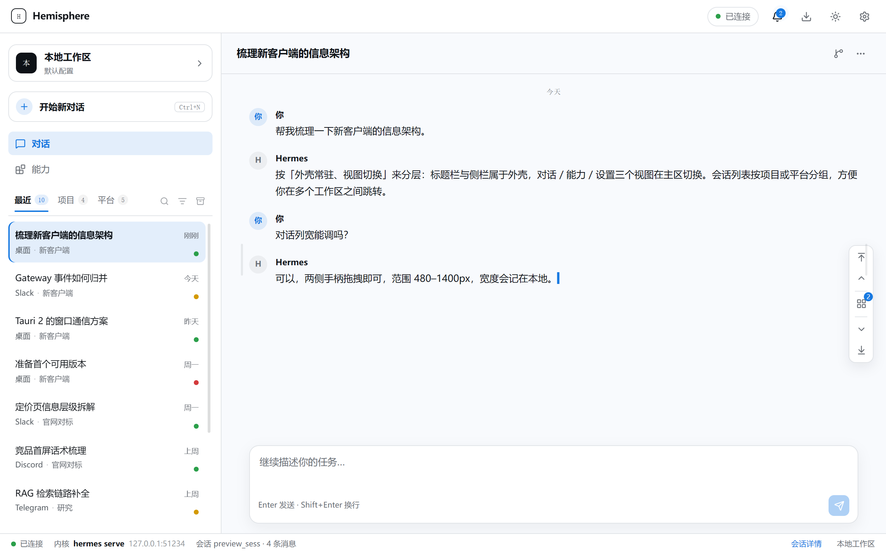

<div align="center">

# Hemisphere

基于 Hermes 内核构建的桌面客户端：会话、流式输出、工具调用与模型能力全部复用
`hermes serve`，界面从零打造。

[](https://hermes-agent.nousresearch.com/docs)
[](./LICENSE)
[](https://v2.tauri.app)
[](https://vuejs.org)
[](https://typescriptlang.org)
[](https://rust-lang.org)

</div>



Hemisphere 不修改 Hermes 本身：内核以 `hermes serve` 原样跑在回环地址上，
客户端只做两件事——把它拉起来，再把它的能力呈现成一套顺手的界面。

## 功能（开发中）

## 架构

三层，职责不交叉：

| 层 | 位置 | 做什么 |
| --- | --- | --- |
| Rust 壳层 | `src-tauri/src/lib.rs` | 拉起并回收 `hermes serve`，把端口与本次 spawn 的令牌交给前端 |
| 前端 | `src/` | Vue 3 + Naive UI：外壳常驻，对话 / 能力 / 设置在主区切换 |
| 内核 | `hermes serve` | 会话、流式、工具、模型调用、技能与 MCP |

```
前端 ──── JSON-RPC over WebSocket ────► hermes serve
 ▲                                          ▲
 │ Tauri IPC                          spawn + 就绪文件（端口）
 └──────────── Rust 壳层 ───────────────────┘
```

## 目录结构

```
src/
├─ layouts/AppShell.vue   外壳：标题栏 / 侧栏 / 主区 / 状态栏
├─ views/                 ConversationView · CapabilitiesView · SettingsView · ConnectView
├─ components/            WorkspaceDialog（档案管理）· ArchiveDialog（已归档对话）
├─ stores/                连接状态与会话流（纯 ref / reactive）
├─ lib/                   gateway-client（JSON-RPC / WS）· platform（按键文案）
├─ theme/                 Naive UI 主题桥接（oklch → hex）
└─ styles/                设计令牌与全局样式
src-tauri/src/lib.rs      Rust 壳层
```

## 许可

[MIT](./LICENSE)
